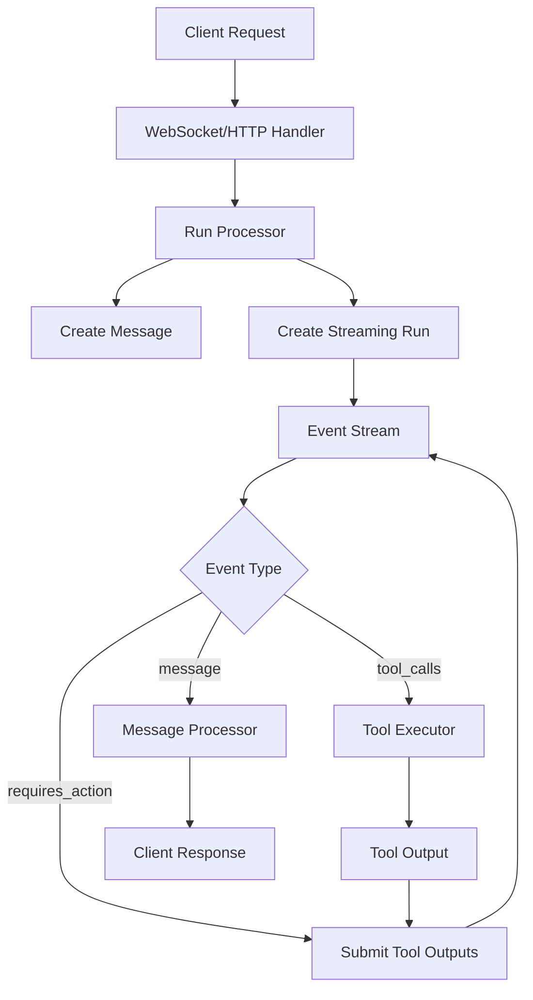

# Processors Module - Technical Documentation

The `processors` module contains the core business logic for handling OpenAI Assistant API interactions, tool execution, message processing, and WebSocket streaming. This module implements the Event-Driven Processing pattern to handle real-time assistant interactions.

## Architecture Overview

```
processors/
├── __init__.py              # Module exports
├── run_processor.py         # OpenAI run orchestration and streaming
├── tool_executor.py         # Tool/function execution engine
├── message_processor.py     # Message and step data processing
└── websocket_processor.py   # WebSocket connection handling
```

## Core Components

### 1. Run Processor (`run_processor.py`)

The `Run` class is the central orchestrator for OpenAI Assistant interactions.

#### Key Responsibilities:
- Creating and managing conversation threads
- Processing streaming events from OpenAI
- Coordinating tool execution
- Handling error recovery with retry logic
- Managing the assistant run lifecycle

#### Main Methods:

```python
async def process_run(thread_id: str, human_query: str) -> list[str]
```
Processes a complete run and returns extracted messages. Used for synchronous HTTP endpoints.

```python
async def process_run_stream(thread_id: str, human_query: str) -> AsyncGenerator[Any, None]
```
Yields streaming events as they arrive. Used for WebSocket connections.

```python
async def iterate_run_events(thread_id: str, human_query: str) -> AsyncGenerator[Any, None]
```
Core event processing loop that handles:
- Message creation
- Tool call execution
- Tool output submission
- Event streaming

#### OpenAI Helper Methods (Private):

```python
async def _retrieve_run(thread_id: str, run_id: str) -> Optional[Any]
async def _list_run_steps(thread_id: str, run_id: str) -> Optional[Any]
async def _submit_tool_outputs_with_backoff(...) -> Optional[Any]
async def _cancel_run_safely(thread_id: str, run_id: str) -> bool
```

These methods provide resilient OpenAI API interactions with:
- Automatic error logging
- Retry logic with exponential backoff
- Safe error handling without exceptions

### 2. Tool Executor (`tool_executor.py`)

The `ToolExecutor` class handles the execution of custom tools/functions that the assistant can call.

#### Key Features:
- Dynamic function registry (`TOOL_MAP`)
- Argument validation against function signatures
- JSON argument parsing
- Comprehensive error handling
- Correlation ID tracking

#### Main Method:

```python
def execute_tool(tool_name: str, tool_args: str | dict, context: dict) -> dict
```

Returns standardized output:
```python
{
    "tool_call_id": "call_123",
    "output": "function result or error message"
}
```

#### Security Considerations:
- Validates all function arguments before execution
- Prevents execution of unknown functions
- Includes correlation IDs in error messages
- Logs all execution attempts

### 3. Message Processor (`message_processor.py`)

Provides data structures and processing logic for OpenAI messages and steps.

#### Data Classes:

**`StepData`** - Represents a single execution step:
- `name`: Step/tool name
- `type`: Step type (e.g., "tool")
- `start`/`end`: ISO formatted timestamps
- `input`/`output`: Step payloads
- `show_input`: Display control flag

**`MessageData`** - Represents a thread message:
- `author`: Message role (user/assistant)
- `content`: Text content
- `id`: Unique identifier

#### Processing Classes:

**`ToolTracker`** - Tracks tool execution state:
- Maintains step references
- Collects tool outputs for submission
- Handles step lifecycle (create/update)

**`ThreadMessage`** - Processes OpenAI thread messages:
- Extracts text content from message objects
- Handles multiple content blocks
- Maintains message references

### 4. WebSocket Processor (`websocket_processor.py`)

The `WebSocketHandler` class manages real-time streaming connections.

#### Key Features:
- Full connection lifecycle management
- Correlation ID tracking per request
- Graceful disconnect handling
- Structured error responses
- Event streaming from Run processor

#### Connection Flow:

1. **Accept Connection** → Log and track connection
2. **Message Loop** → Process incoming requests continuously
3. **Request Validation** → Ensure thread_id and message present
4. **Stream Processing** → Forward events from Run processor
5. **Error Handling** → Send structured error messages
6. **Cleanup** → Close connection gracefully

#### Error Response Format:
```json
{
    "error": "Error message",
    "type": "error_type",
    "event": "error"
}
```

## Event Flow



## Error Handling Strategy

### 1. **Layered Error Handling**
- Each processor handles its specific errors
- Errors are logged with correlation IDs
- HTTP errors mapped to appropriate status codes

### 2. **Retry Logic**
- Tool output submission: 3 retries with exponential backoff
- Run cancellation on permanent failures
- Graceful degradation for non-critical operations

### 3. **Error Types**
- **OpenAI Errors** → 502 Bad Gateway
- **Validation Errors** → 400 Bad Request
- **Tool Errors** → Included in response with correlation ID
- **WebSocket Errors** → Structured error messages

## Usage Examples

### HTTP Endpoint Usage
```python
# In FastAPI route
run_processor = Run(client, config)
messages = await run_processor.process_run(thread_id, user_message)
return {"responses": messages}
```

### WebSocket Usage
```python
# In WebSocket endpoint
ws_handler = WebSocketHandler(run_processor)
await ws_handler.handle_connection(websocket)
```

### Tool Registration
```python
# In tools.py
def my_tool(param: str) -> str:
    return f"Processed: {param}"

TOOL_MAP = {
    "my_tool": my_tool
}
```

## Best Practices

1. **Always use correlation IDs** for request tracking
2. **Log at appropriate levels** (INFO for operations, ERROR for failures)
3. **Handle disconnections gracefully** in streaming operations
4. **Validate inputs early** to fail fast
5. **Use type hints** for all method signatures
6. **Keep tool functions pure** and side-effect free
7. **Test error paths** as thoroughly as happy paths

## Dependencies

- `openai`: AsyncOpenAI client for API interactions
- `fastapi`: WebSocket support
- `structlog`: Structured logging with correlation IDs
- `asyncio`: Async/await support
- `json`: JSON parsing for tool arguments
- `inspect`: Function signature validation

## Testing

The processors module includes comprehensive test coverage:
- `test_run_processor.py`: Run processing and OpenAI integration
- `test_tool_executor.py`: Tool execution and validation
- `test_message_processor.py`: Message and step processing
- `test_websocket_processor.py`: WebSocket handling

Tests use AsyncMock and custom dummy clients to avoid external dependencies.