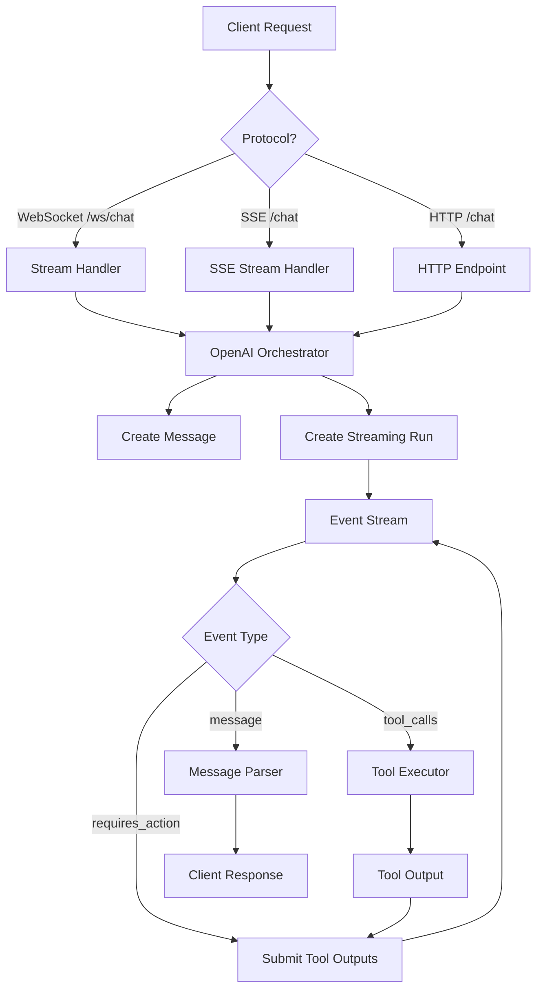

# Services Module

This module contains the core business logic for OpenAI Assistant API interactions, tool execution, message processing, and real-time streaming. It implements event-driven processing to handle assistant interactions in real-time via both WebSocket and Server-Sent Events (SSE).

## Streaming Protocols

The service supports two streaming protocols:
- **WebSocket** (`/ws/chat`) - Bidirectional communication for interactive chat applications
- **Server-Sent Events** (`/chat` with Accept: text/event-stream) - Unidirectional streaming for web applications

## Architecture Overview

```
services/
├── __init__.py              # Module exports
├── openai_orchestrator.py   # OpenAI assistant orchestration and streaming
├── tool_executor.py         # Tool/function execution engine
├── message_parser.py        # Message and step data parsing
├── stream_handler.py        # WebSocket streaming and connection handling
└── sse_stream_handler.py    # Server-Sent Events (SSE) streaming handler
```

## Core Components

The services module is organized around five main components that work together to provide streaming assistant interactions:

### 1. OpenAI Orchestrator (`openai_orchestrator.py`)

The central orchestrator that manages all interactions with the OpenAI Assistant API. This component handles the complete lifecycle of assistant runs, from thread creation to response streaming.

**Key Responsibilities:**
- Creating and managing conversation threads
- Processing streaming events from OpenAI
- Coordinating tool execution
- Handling error recovery with retry logic
- Managing the assistant run lifecycle

**Main Methods:**

```python
async def process_run(thread_id: str, human_query: str) -> list[str]
```
Processes a complete run and returns extracted messages. Used for synchronous HTTP endpoints.

```python
async def process_run_stream(thread_id: str, human_query: str) -> AsyncGenerator[Any, None]
```
Yields streaming events as they arrive. Used for WebSocket connections.

```python
async def iterate_run_events(thread_id: str, human_query: str) -> AsyncGenerator[Any, None]
```
Core event processing loop that handles:
- Message creation
- Tool call execution
- Tool output submission
- Event streaming

**OpenAI Helper Methods (Private):**

```python
async def _retrieve_run(thread_id: str, run_id: str) -> Optional[Any]
async def _list_run_steps(thread_id: str, run_id: str) -> Optional[Any]
async def _submit_tool_outputs_with_backoff(...) -> Optional[Any]
async def _cancel_run_safely(thread_id: str, run_id: str) -> bool
```

These methods provide resilient OpenAI API interactions with:
- Automatic error logging
- Retry logic with exponential backoff
- Safe error handling without exceptions

### 2. Tool Executor (`tool_executor.py`)

Handles the secure execution of custom Python functions when the assistant determines it needs to use a tool. This component acts as the bridge between OpenAI's function calling and your business logic.

**Key Features:**
- Dynamic function registry (`TOOL_MAP`)
- Argument validation against function signatures
- JSON argument parsing
- Comprehensive error handling
- Correlation ID tracking

**Main Method:**

```python
def execute_tool(tool_name: str, tool_args: str | dict, context: dict) -> dict
```

Returns standardized output:
```python
{
    "tool_call_id": "call_123",
    "output": "function result or error message"
}
```

**Security Considerations:**
- Validates all function arguments before execution
- Prevents execution of unknown functions
- Includes correlation IDs in error messages
- Logs all execution attempts

### 3. Message Parser (`message_parser.py`)

Provides data structures and parsing logic for OpenAI messages and execution steps. This component transforms raw OpenAI events into structured data for processing.

**Data Classes:**

**`StepData`** - Represents a single execution step:
- `name`: Step/tool name
- `type`: Step type (e.g., "tool")
- `start`/`end`: ISO formatted timestamps
- `input`/`output`: Step payloads
- `show_input`: Display control flag

**`MessageData`** - Represents a thread message:
- `author`: Message role (user/assistant)
- `content`: Text content
- `id`: Unique identifier

**Processing Classes:**

**`ToolTracker`** - Tracks tool execution state:
- Maintains step references
- Collects tool outputs for submission
- Handles step lifecycle (create/update)

**`MessageParser`** - Parses OpenAI thread messages:
- Extracts text content from message objects
- Handles multiple content blocks
- Maintains message references

### 4. WebSocket Stream Handler (`stream_handler.py`)

Manages real-time bidirectional streaming connections via WebSocket at the `/ws/chat` endpoint. This handler maintains persistent connections for interactive chat applications.

**Key Features:**
- Full connection lifecycle management
- Correlation ID tracking per request
- Graceful disconnect handling
- Structured error responses
- Event streaming from OpenAI orchestrator

**Connection Flow:**

1. **Accept Connection** → Log and track connection
2. **Message Loop** → Process incoming requests continuously
3. **Request Validation** → Ensure thread_id and message present
4. **Stream Processing** → Forward events from OpenAI orchestrator
5. **Error Handling** → Send structured error messages
6. **Cleanup** → Close connection gracefully

**Error Response Format:**
```json
{
    "error": "Error message",
    "type": "error_type",
    "event": "error"
}
```

### 5. SSE Stream Handler (`sse_stream_handler.py`)

Manages Server-Sent Events streaming for web applications via the `/chat` endpoint. This handler provides unidirectional streaming with automatic reconnection support.

**Key Features:**
- Server-to-client only streaming (unidirectional)
- Automatic reconnection support with retry intervals
- Heartbeat mechanism to detect stale connections
- Event ID tracking for resumption
- Metadata events with performance metrics

**Event Types:**
- **Message Events**: `thread.message.delta`, `thread.run.completed`
- **Metadata Events**: Performance metrics, correlation IDs
- **Error Events**: Structured error information
- **Heartbeat Comments**: Keep-alive signals

**SSE Format:**
```
event: thread.message.delta
id: correlation_123_delta_1
data: {"delta": {"content": "Hello"}}
retry: 5000

:
```

## Event Flow



## Error Handling Strategy

The service implements a comprehensive error handling strategy to ensure reliability and debuggability in production:

### 1. Layered Error Handling
- Each component handles its specific error types
- All errors include correlation IDs for tracing
- HTTP status codes accurately reflect error types

### 2. Retry Logic
- Tool output submission: 3 retries with exponential backoff
- Run cancellation on permanent failures
- Graceful degradation for non-critical operations

### 3. Error Types
- **OpenAI Errors** → 502 Bad Gateway
- **Validation Errors** → 400 Bad Request
- **Tool Errors** → Included in response with correlation ID
- **WebSocket Errors** → Structured error messages

## Usage Examples

These examples show how the service components are used within the FastAPI application:

### HTTP Endpoint (Traditional Request/Response)

Used in `server/main.py` for the `/chat` endpoint without streaming:

```python
# Traditional request/response pattern
orchestrator = OpenAIOrchestrator(client, config)
messages = await orchestrator.process_run(thread_id, user_message)
return {"responses": messages}
```

### SSE Streaming

Used in `server/main.py` when client sends `Accept: text/event-stream` header:

```python
from sse_starlette.sse import EventSourceResponse

async def chat_sse(request: ChatRequest):
    async def event_generator():
        async for event in orchestrator.process_run_stream(
            request.thread_id, request.message
        ):
            # Format events for SSE protocol
            yield {
                "event": event.event,
                "data": event.model_dump_json(),
                "id": f"{correlation_id}_{event.event}_{count}"
            }
    
    return EventSourceResponse(event_generator())
```

### WebSocket Streaming

Used in `server/main.py` for the `/ws/chat` endpoint:

```python
# WebSocket endpoint for bidirectional streaming
stream_handler = StreamHandler(orchestrator)
await stream_handler.handle_connection(websocket)
```

### Tool Registration

Define custom functions in `assistant_service/tools.py`:

```python
def my_tool(param: str) -> str:
    """Tool description for the assistant."""
    return f"Processed: {param}"

# Register in TOOL_MAP for discovery
TOOL_MAP = {
    "my_tool": my_tool
}
```

## Best Practices

1. **Always use correlation IDs** for request tracking
2. **Log at appropriate levels** (INFO for operations, ERROR for failures)
3. **Handle disconnections gracefully** in streaming operations
4. **Validate inputs early** to fail fast
5. **Use type hints** for all method signatures
6. **Keep tool functions pure** and side-effect free
7. **Test error paths** as thoroughly as happy paths

## Dependencies

- `openai`: AsyncOpenAI client for API interactions
- `fastapi`: WebSocket support
- `structlog`: Structured logging with correlation IDs
- `asyncio`: Async/await support
- `json`: JSON parsing for tool arguments
- `inspect`: Function signature validation

## Testing

Run the comprehensive test suite for the services module:

```bash
# Run all service tests
make unit-test

# Run with coverage report
make all-test

# Run specific test file
uv run pytest tests/assistant_service/services/test_openai_orchestrator.py -v
```

The test suite covers:
- OpenAI orchestration and integration flows
- Tool execution and validation logic
- Message and step parsing
- Stream handling and WebSocket connections

Tests use AsyncMock and custom dummy clients to avoid external dependencies while maintaining realistic behavior.